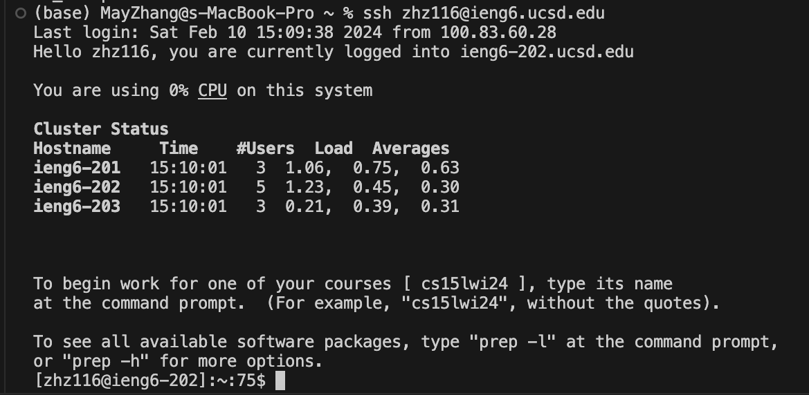

# Lab Report 2 
## Servers and SSH Keys

### Part 1
In this part, we wrote a web server called `ChatServer` that supports adding chat messages in the form of `<user> : <message>`.

By adding /add-message?s=How are you&user=yash to the URL, the handleRequest method is being triggered.
1. It extracts the user and the message from the URL parameters. In this case, the URL contains `user=jpolitz` and `s=Hello`, then the user is interpreted as `jpolitz`, and the message as `Hello`.
2. These values are then used to form a single `String`, where the format is `user: message`. So in this instance, it would be `"jpolitz: Hello"`.
3. This newly constructed `String` is then added to an `ArrayList` of `String` named `list`, which is a field in the `Handler` class.
4. The `list` is then returned as a `String` where each message is presented on a new line, providing a history of the chat.

We then add the path `add-message` to the URL again by adding  `/add-message?s=How are you&user=yash`. 
1. It extracts the user and the message from the URL parameters. In this case, the URL contains `user=yash` and `s=How are you`, then the user is interpreted as `yash`, and the message as `How are you`.
2. These values are then used to form a single `String`, where the format is `user: message`. So in this instance, it would be `"yash: How are you"`.
3. This newly constructed `String` is then added to an `ArrayList` of `String` named `list`, which is a field in the `Handler` class.
4. The `list` is then returned as a `String` where each message is presented on a new line, providing a history of the chat.
5. The chat message is display on the webpage, appended after the last message.

The code for `ChatServer` is shown below:

### Part 2
The absolute path to the private and public key for the SSH key for logging into `ieng6` is shown below using the `ls` command.
The private key in shown from the local computer and the public key from `ieng6`.

After running `ssh-keygen`, we can log into the `ieng6` account without being asked for password.

### Part 3
In this two weeks, I learnt about how to **remotely connecting** to my `ieng6` account with the use of `ssh` command, 
building and **running a server** with different input path, and learnt the `curl` command, which prints out what it 
accesses to the terminal. I learnt how the **port number** works, and how the ways to run the server differ running on
local and remote machines.
