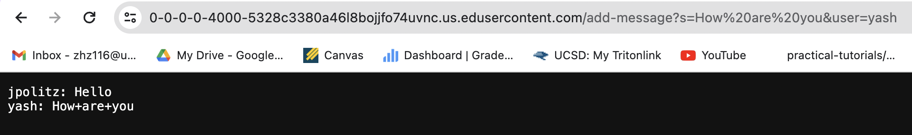

# Lab Report 2 
## Servers and SSH Keys

### Part 1
In this part, we wrote a web server called `ChatServer` that supports adding chat messages in the form of `<user> : <message>`.

First we called the  `add-message` method by adding `/add-message?s=Hello&user=jpolitz` to the browser link.
1. The relevant argument to those methods is the port number.
2. The values here are Strings `user` and String `message`. The user here is  `jpolitz` and the message is `Hello`. 
3. The values of the `user` and `message` do not change since we only display the message instead of making any changes to the values.

We then use the `add-message` method again by adding  `/add-message?s=How are you&user=yash`. 
1. The user here is  `yash` and the message is `How are you`. 
2. The `user` and `message` value change to the current input. The chat message is display on the webpage, appended after the last message.

The code for `ChatServer` is shown below:

### Part 2
The absolute path to the private and public key for the SSH key for logging into `ieng6` is shown below using the `ls` command.

The path is found when running `ssh-keygen`.

After running `ssh-keygen`, we can log into the `ieng6` account without being asked for password.

### Part 3
In this two weeks, I learnt about how to **remotely connecting** to my `ieng6` account with the use of `ssh` command, 
building and **running a server** with different input path, and learnt the `curl` command, which prints out what it 
accesses to the terminal. I learnt how the **port number** works, and how the ways to run the server differ running on
local and remote machines.
