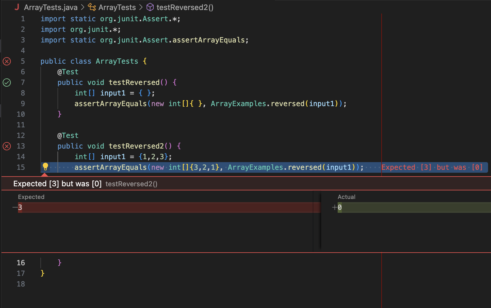

# Lab Report 3 
## Bugs and Commands

### Part 1 - Bugs
A failure-inducing input for the buggy program is shown below:
```
  @Test
  public void testReversed2() {
    int[] input1 = {1,2,3};
    assertArrayEquals(new int[]{3,2,1}, ArrayExamples.reversed(input1));
  }
```
The integer array includes three elements, and when we try to reverse it, the output array only reverse half of the array while the other 
Below is another Junit test, which does not induce a failure. The empty array in this case is empty.
```
  @Test
  public void testReversed() {
    int[] input1 = { };
    assertArrayEquals(new int[]{ }, ArrayExamples.reversed(input1));
  }
```
The test below suggests that the `reversed` method is able to return an array but in an incorrect format. 
As shown in the screenshot of the symptoms below, of the two tests, one passed, and the other one failed. It shows that at least one of the element in the output array 
differs from the expected array.



Now we will look at the code part and catch the bug.
This the original code, which failed the test.
```
  // Returns a *new* array with all the elements of the input array in reversed
  // order
  static int[] reversed(int[] arr) {
    int[] newArray = new int[arr.length];
    for(int i = 0; i < arr.length; i += 1) {
      arr[i] = newArray[arr.length - i - 1];
    }
    return arr;
  }
```
There is a bug in the following line:
```
arr[i] = newArray[arr.length - i - 1];
```
This line is trying to set the (i)th element in the original array `arr` which is wrong. It means the reversed elements are being put back into the original array `arr`, 
rather than the new array `newArray`.

The corrected function would look something like:
```
static int[] reversed(int[] arr) {
  int[] newArray = new int[arr.length];
  for(int i = 0; i < arr.length; i += 1) {
    newArray[i] = arr[arr.length - i - 1];
  }
  return newArray;
}
```
This line correctly sets the (i)th position in the new array `newArray` as the reversed element from the original array `arr`.


### Part 2 - Research Commands

1. **-i flag:** This flag makes grep case insensitive.

***Example 1:*** Here we try the `grep` command both with and without the `-i` flag to find the string `study` in the file `technical/biomed/1468-6708-3-1.txt`.
   The word count of the strings found in the case insensitive case is greater than the one case sensitive.
```
(base) MayZhang@s-MacBook-Pro docsearch % grep "study" technical/biomed/1468-6708-3-1.txt
        events [ 10 ] . In this paper we study whether BMI at
          population-based longitudinal study of 5,888 adults aged
        from EVGFP) in the first seven years of the study, adjusted
(base) MayZhang@s-MacBook-Pro docsearch % grep "study" technical/biomed/1468-6708-3-1.txt > find_word.txt
(base) MayZhang@s-MacBook-Pro docsearch % wc -w find_word.txt 
      31 find_word.txt
(base) MayZhang@s-MacBook-Pro docsearch % grep -i "study" technical/biomed/1468-6708-3-1.txt > find_word2.txt
(base) MayZhang@s-MacBook-Pro docsearch % wc -w find_word2.txt
      48 find_word2.txt
```

***Example 2:*** Here we use the case insensitive grep command to find the string `health` from all the text files under the directory `technical/biomed`. 
As shown in the first ten outputs, there are both string `health` in upper- and lower-case forms.

```
(base) MayZhang@s-MacBook-Pro docsearch % grep -i "health" technical/biomed/*.txt > health.txt
(base) MayZhang@s-MacBook-Pro docsearch % head -10 < health.txt
technical/biomed/1468-6708-3-1.txt:        Many healthy older adults report gradual weight gain
technical/biomed/1468-6708-3-1.txt:        most robust health as we age. It has been suggested that
technical/biomed/1468-6708-3-1.txt:        quality of life or years of healthy life (YHL) in the
technical/biomed/1468-6708-3-1.txt:        on health than on mortality. If so, then behavior change
technical/biomed/1468-6708-3-1.txt:        they were evaluated on improved health, rather than on
technical/biomed/1468-6708-3-1.txt:        years of being healthy, in a cohort of older adults for
technical/biomed/1468-6708-3-1.txt:          Study design: The Cardiovascular Health
technical/biomed/1468-6708-3-1.txt:          The Cardiovascular Health Study (CHS) is a
technical/biomed/1468-6708-3-1.txt:          Years of life and years of healthy life
technical/biomed/1468-6708-3-1.txt:          which the person was 'healthy', and is similar in concept
```

2. **-r flag:** This flag tells grep to read all files under each directory, recursively.

***Example 3:*** The example shows that the strings `base pair` under the `technical` directory are found under different directories, 
some under `biomed`, some under `plos` directory.
```
(base) MayZhang@s-MacBook-Pro docsearch % grep -r "base pair" technical/ > output.txt
(base) MayZhang@s-MacBook-Pro docsearch % head -10 < output.txt
technical//plos/journal.pbio.0020223.txt:        Watson-Crick base pairing, the proximity of the synthetic reactive groups elevates their
technical//plos/journal.pbio.0020190.txt:        sequence, which is a specific series of eight base pairs in the DNA of the bacterial
technical//plos/journal.pbio.0020190.txt:        chromosomes, on the order of one or two thousand base pairs of DNA (or less—their length is
technical//biomed/1471-2156-2-3.txt:          three exons. The first exon contains 279 base pairs (bp)
technical//biomed/1471-2121-3-10.txt:        both encode a 10-base pair sequence that is identical to
technical//biomed/1471-2121-3-10.txt:        the P3 sequence with an insertion of 3 base pairs at
technical//biomed/gb-2001-2-4-research0010.txt:          necessarily true because of Watson-Crick base pairing.
technical//biomed/gb-2003-4-4-r24.txt:        important considering that within a few hundred base pairs,
technical//biomed/gb-2001-2-4-research0011.txt:          sequenced to completion, yielding a 1,036 base pair (bp)
technical//biomed/1471-2229-2-3.txt:        stringency with a 300 base pair homologous
```

***Example 4:*** The example shows that the strings `Cardiovascular` under the `technical/biomed` directory are found under different text files.
```
(base) MayZhang@s-MacBook-Pro docsearch % grep -r "Cardiovascular" technical/biomed > output.txt
(base) MayZhang@s-MacBook-Pro docsearch % head -10 < output.txt 
technical/biomed/1471-2350-4-4.txt:          University of Chicago's Cardiovascular Genetics Clinic
technical/biomed/1471-2474-2-3.txt:        Cardiovascular diseases, a major health concern in
technical/biomed/cc303.txt:          E. Cardiovascular complications
technical/biomed/1471-2164-3-32.txt:          Biology, the Cardiovascular System, Immunology and
technical/biomed/1472-6947-2-7.txt:          groups such as the Northern New England Cardiovascular
technical/biomed/1471-2350-2-11.txt:        Cardiovascular features included aortic dilatation in
technical/biomed/1472-6793-2-1.txt:            Cardiovascular variables were analyzed immediately
technical/biomed/1468-6708-3-1.txt:          Study design: The Cardiovascular Health
technical/biomed/1468-6708-3-1.txt:          The Cardiovascular Health Study (CHS) is a
technical/biomed/1468-6708-3-1.txt:        CHS Cardiovascular Health Study
```

3. ***-v flag:*** This flag inverts the search, returning all lines that do not contain the pattern.

***Example 5:*** In this example, the `grep` command would output the lines without the string `and` under the file `technical/biomed/1468-6708-3-3.txt`. 
We search the string `and` in the output text file and no lines is returned, and when we use the `-v` flag again, the whole content in the output file is returned.
```
(base) MayZhang@s-MacBook-Pro docsearch % grep -v "and" technical/biomed/1468-6708-3-3.txt > output.txt
(base) MayZhang@s-MacBook-Pro docsearch % grep "and" output.txt
(base) MayZhang@s-MacBook-Pro docsearch % grep -v "and" output.txt

  
    
      
        The problem
        unequivocally demonstrated that 3-Hydroxy-3-methylgluatryl
        coenzyme A (HMG CoA) reductase inhibitors (statins) reduce
        disease. These trials found that when compared with
        placebo, statins significantly reduced the incidence of
        death, myocardial infarction, unstable angina, percutaneous
        persons with ...
```

***Example 6:*** In this example, the `grep` command would output the lines without the string `problem` under the file `technical/biomed/1468-6708-3-3.txt`. 
The string `problem` is selected from the first line of the file, and the output content returned the lines starting from the second lines, which verify that 
the lines with the string `problem` is not outputed.
```
MayZhang@s-MacBook-Pro docsearch % grep -v "problem" technical/biomed/1468-6708-3-3.txt

  
    
      
        Three published [ 1 2 3 ] and one recently presented [ 4
        ] randomized placebo-controlled clinical trial have
        unequivocally demonstrated that 3-Hydroxy-3-methylgluatryl
        coenzyme A (HMG CoA) reductase inhibitors (statins) reduce
        the morbidity and mortality associated with coronary
        disease. These trials found that when compared with ...
```
4. ***-l flag:*** This flag tells grep to print out only the names of files that contain the specific pattern.

***Example 7:*** In this example, the `grep`command is used to find the string `coenzyme A` from all the text files under the directory `technical/biomed`.
Without the `-l` flag, all the lines that contain the string `coenzyme A` is listed, including the information of the file it is from and the content of the line.
With the `-l` flag, it only shows the name of the files that include the string `coenzyme A`. Unlike the one without the flag, each filename is shown once only.
```
(base) MayZhang@s-MacBook-Pro docsearch % grep "coenzyme A" technical/biomed/*.txt > output.txt
(base) MayZhang@s-MacBook-Pro docsearch % head -5 output.txt 
technical/biomed/1468-6708-3-3.txt:        coenzyme A (HMG CoA) reductase inhibitors (statins) reduce
technical/biomed/1468-6708-3-3.txt:        HMG CoA = 3-Hydroxy-3-methylgluatryl coenzyme A; MIRACL
technical/biomed/1471-2121-4-3.txt:          both saturated and unsaturated fatty acyl coenzyme A
technical/biomed/1471-2121-4-3.txt:          saturated fatty acyl coenzyme A ester could also
technical/biomed/1471-2121-4-3.txt:          stimulated by arachidoyl coenzyme A in a concentration
(base) MayZhang@s-MacBook-Pro docsearch % grep -l "coenzyme A" technical/biomed/*.txt
technical/biomed/1468-6708-3-3.txt
technical/biomed/1471-2121-4-3.txt
technical/biomed/1471-2369-3-9.txt
technical/biomed/1471-2474-4-8.txt
technical/biomed/1476-511X-1-2.txt
```

***Example 8:*** In this example, the `grep` command returns the name of the files that contain the string `institute`  from all the text files under the directory `technical/plos`.
```
(base) MayZhang@s-MacBook-Pro docsearch % grep -l "institute" technical/plos/*.txt
technical/plos/journal.pbio.0020214.txt
technical/plos/journal.pbio.0020306.txt
technical/plos/journal.pbio.0020394.txt
technical/plos/journal.pbio.0030024.txt
technical/plos/pmed.0010056.txt
technical/plos/pmed.0020024.txt
technical/plos/pmed.0020028.txt
technical/plos/pmed.0020062.txt
technical/plos/pmed.0020210.txt
```

### ***Citation***
The function of the command is cited from ChatGPT, including the flags for `grep` command suggested, and the way to use it.
