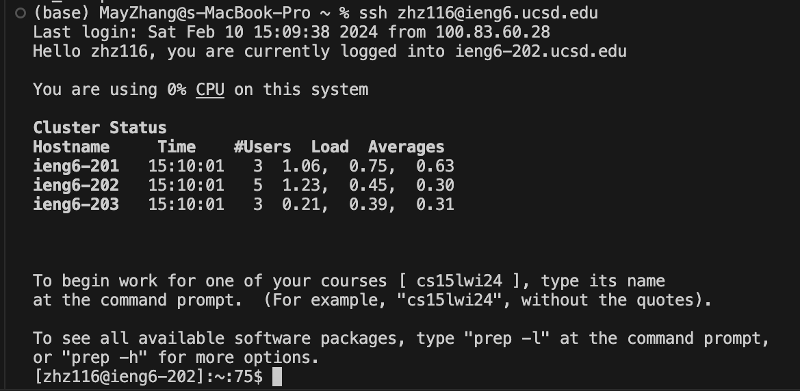
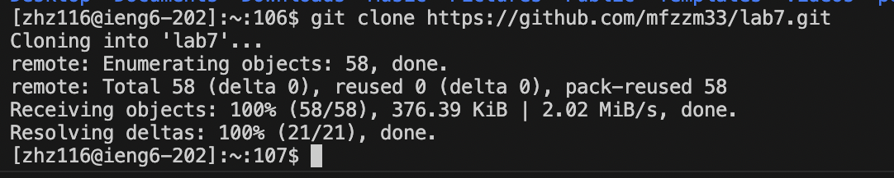
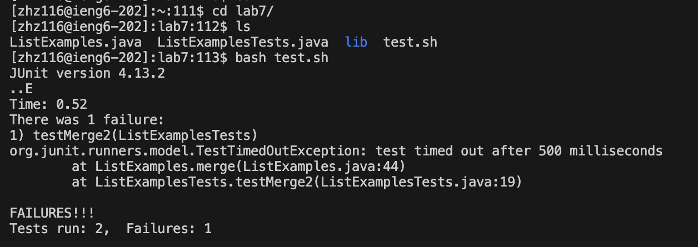
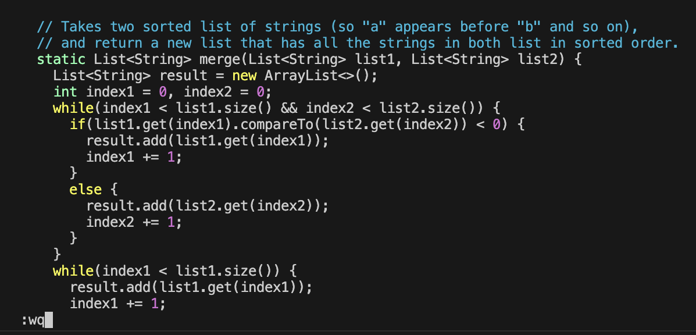
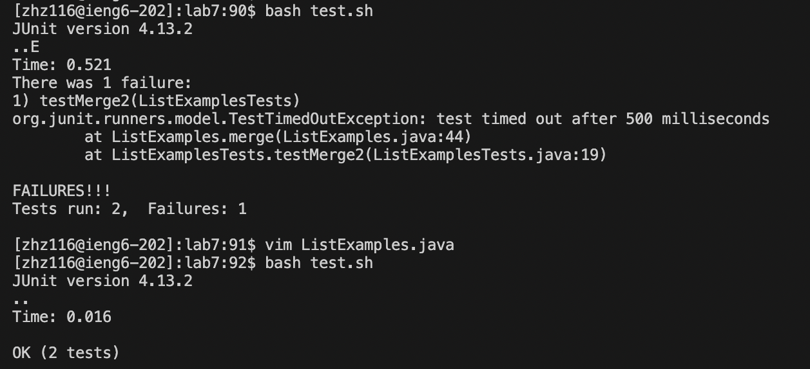
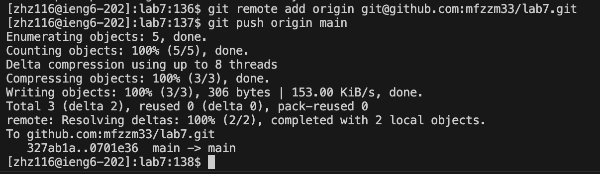

# Lab Report 4 
## Vim

This lab involves logging into a server (ieng6) using SSH, cloning a forked GitHub repository onto that server, fixing failing tests in a code file, 
and then committing and pushing those changes back to the forked repository on your GitHub account.

### Log into ieng6

Key pressed: `ssh zhz116@ieng6.ucsd.edu `.
This is a command to establish a secure shell (SSH) connection to the host `ieng6.ucsd.edu` using the username `zhz116`.
### Clone your fork of the repository from your Github account (using the SSH URL)

Key pressed: `git clone https://github.com/mfzzm33/lab7.git`
This command is used to clone (copy) a GitHub repository currently located at `https://github.com/mfzzm33/lab7.git` onto your local drive. 
The repository will be cloned into a new directory named "lab7" created in the current directory from which the command is run.

### Run the tests, demonstrating that they fail

Key pressed: `cd lab7/` `ls` `bash test.sh`
We changed directory to `lab7` to access the test file, use `ls` to show the files in this directory, and run the script file named `test.sh` with `bash` 
to execute the testing commands.

### Edit the code file to fix the failing test

Key pressed: `vim ListExamples.java` `11j` `e` `r2` `:wq`
We moves the cursor down (j indicates down) 11 lines from its current position with `11j`. `e` is then used to move the cursor to the end of a word.
The `r` command replaces the character 1 under the cursor with the character 2, changing `index1` to `index2`.
At last, The `:wq` command is used to write (save) the file and then quit. 

### Run the tests, demonstrating that they now succeed

Key pressed: `<up><up><enter>`
The command `bash test.sh` is re-run by pressing the Up Arrow key twice, which navigates through the command history, showing the second most recent commands we've run.

### Commit and push the resulting change to your Github account

Key pressed: `git remote add origin git@github.com:mfzzm33/lab7.git` `git push origin main`

`git remote add origin git@github.com:mfzzm33/lab7.git` command adds a remote repository named "origin" that is linked to the URL `git@github.com:mfzzm33/lab7.git`.
`git push origin main` command pushes the local changes to the "main" branch of the remote repository named "origin".
